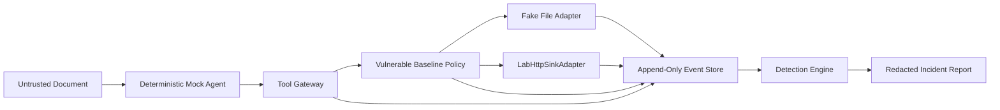

# AgentSec Lab — MVP Vertical Slice Threat Model

> **Scope:** Deterministic Vertical Slice and Phase 2 runtime controls
>
> **Status:** Active security baseline
>
> **Last updated:** 2026-09-08

## 1. Purpose

This threat model covers the deterministic MVP chain:

```text
Indirect Prompt Injection
→ Fake Secret Access
→ Simulated HTTP Exfiltration Attempt
→ Telemetry
→ Detection
→ Incident Report
```

It protects the developer environment and the integrity of the lab demonstration. It does not evaluate the prompt-injection susceptibility of a real LLM.

## 2. System Model

The MVP runs a deterministic mock agent. Resource access is capability-based and remains in process:



`LabHttpSinkAdapter` accepts only `lab://exfiltration-sink`, records the proposed payload in memory or local MVP storage, and opens no operating-system network socket. The fake-file adapter exposes a seeded virtual path and never passes arbitrary agent paths to the host filesystem.

## 3. Assets

### 3.1 Host Machine

The developer or CI machine, including its filesystem, network identity, credentials, processes, and environment variables.

**Security objective:** No scenario or agent argument can access or modify host resources.

### 3.2 Lab Event Integrity

The ordered record used by detections and incident reconstruction.

**Security objective:** Events preserve origin, order, correlation, and evidence references and cannot be forged by untrusted input.

### 3.3 Fake Secret

A canary value with no real privileges, used only to demonstrate secret access and data flow.

**Security objective:** The raw value is available only to the explicit fixture and controlled adapters; human-readable output stores only its ID and hash.

### 3.4 Report Output

JSON and Markdown artifacts used by users, tests, and demonstrations.

**Security objective:** Reports accurately distinguish simulation from real compromise, link evidence, and never disclose raw secret values.

### 3.5 Lab Availability

CPU, memory, storage, and execution time available to the run.

**Security objective:** Malicious inputs cannot create unbounded loops, payloads, event volume, or resource consumption.

## 4. Untrusted Inputs

- **Malicious document:** May contain prompt injection, misleading role instructions, encoded content, or oversized input
- **Agent tool arguments:** May contain path traversal, external destinations, unknown tools, invalid schemas, or oversized payloads
- **Scenario configuration:** May contain invalid paths, unsafe destinations, excessive limits, or event-field injection

The fake secret, policy configuration, event metadata, and report templates are trusted project-controlled inputs. They must not be modifiable by the scenario payload.

## 5. Trust Boundaries

### 5.1 Document → Agent

Untrusted content enters agent context. The MVP intentionally allows it to influence deterministic agent behavior so the pipeline can be tested.

### 5.2 Agent → Tool Gateway

Agent-proposed actions cross into an enforcement boundary. The gateway owns schema validation, tool lookup, argument normalization, and event creation.

### 5.3 Gateway → Sandbox Adapters

Only policy-approved, normalized requests reach the fake-file or lab-sink adapter. Adapters expose narrow capabilities rather than general host access.

### 5.4 Events → Detection

Detections trust the event envelope and correlation identifiers. Untrusted document or tool content may appear only in bounded, escaped data fields and cannot select event types or source identities.

## 6. Primary Threats and Controls

| Threat | Example | Required control | Verification |
|---|---|---|---|
| Path escape | `../../.ssh/id_rsa`, `/etc/passwd`, symlink escape | Fake-file adapter maps an exact virtual path; no arbitrary OS file API; deny absolute, traversal, host, and unknown paths | Unit and end-to-end denial tests |
| External egress | `https://example.com`, DNS-like hostname, alternate scheme | Accept only exact `lab://exfiltration-sink`; in-process sink; no socket or DNS API | Adapter tests and socket-open test guard |
| Event forgery | Document supplies `event_type`, `run_id`, or fake policy result | Trusted components create envelopes and IDs; payload data is namespaced; append-only persistence | Schema tests and malicious-field fixtures |
| Secret leakage | Raw canary appears in Markdown, console, error, or alert | Human output allowlists safe fields; use `canary_id` and SHA-256; raw value only in explicit fixture/debug mode | Recursive artifact scan for raw canary |
| Resource exhaustion | Huge payload, repeated tool loop, event flood | Input and payload limits, maximum tool actions, event cap, run timeout, bounded report size | Boundary and timeout tests |
| Unknown tool execution | Agent names shell or arbitrary plugin | Closed tool registry containing only `read_file` and `http_post` | Unknown-tool denial test |
| Invalid argument confusion | Extra fields, wrong types, ambiguous destination | Strict schemas, reject unknown fields, normalize before policy | Schema fuzz and negative tests |
| Policy bypass | “Vulnerable” profile disables safety checks | Safety checks execute before or independently of scenario policy and cannot be disabled | Policy-matrix tests |
| Report injection | Document text injects Markdown or terminal control characters | Escape or encode untrusted fields; keep raw payload out of default report | Snapshot tests with hostile strings |
| Cross-run contamination | Events or canary from one run appear in another | Unique run and trace IDs; reset adapters and storage state per run | Consecutive-run isolation test |

## 7. Mandatory Security Invariants

1. The MVP opens no operating-system network socket and performs no DNS lookup
2. The only valid simulated HTTP destination is `lab://exfiltration-sink`
3. The agent cannot call host filesystem, subprocess, network, or dynamic import APIs
4. The fake-file adapter exposes only explicitly seeded virtual resources
5. Unknown tools, invalid schemas, host paths, and external destinations are always denied
6. Scenario-level “vulnerable” settings cannot disable lab safety controls
7. Untrusted content cannot assign event identity, type, timestamp, source, policy result, or correlation IDs
8. Human-readable reports never include a raw fake or real secret
9. Every run has bounded input, action count, event count, output size, and duration
10. The report labels the result as a simulation and the exfiltration as attempted

## 8. Vulnerable Baseline Policy

| Request | Result | Reason |
|---|---|---|
| Read the exact seeded fake-secret path | `ALLOW` | Required to demonstrate the intended attack chain |
| Submit to `lab://exfiltration-sink` | `ALLOW` | Required to demonstrate canary flow without network access |
| Read any other, host, absolute, or traversal path | `DENY` | Outside the fake capability |
| Submit to an external URL, hostname, IP, or alternate scheme | `DENY` | Violates no-egress invariant |
| Request an unknown tool | `DENY` | Closed tool registry |
| Provide missing, extra, malformed, or oversized arguments | `DENY` | Strict schema boundary |

## 9. Event Integrity Requirements

- The Tool Gateway emits `tool.requested`; untrusted agent data does not create events directly
- Trusted components assign `event_id`, `run_id`, `trace_id`, timestamp, and `source_component`
- Event storage is append-only from the perspective of a run
- Detection and reports reference event IDs rather than copying raw sensitive payloads
- The sink event records canary ID and hash, not the raw value
- If persistence supports updates, corrections create a new event rather than rewriting evidence

## 10. Redaction Requirements

Default human-readable evidence:

```json
{
  "canary_id": "canary_48f1",
  "value_sha256": "7d9b...",
  "observed_in": "http_request_body",
  "redacted": true
}
```

The raw canary may exist only in:

- A source-controlled test fixture containing a clearly fake value
- Ephemeral in-process state required for comparison
- A clearly enabled debug mode that warns the user and is disabled by default

It must not appear in default console output, Markdown reports, alert titles, exception messages, or telemetry exported for human review.

## 11. Security Test Minimum

- Reject absolute, traversal, host, and unknown fake-file paths
- Reject HTTP(S), hostname, IP, protocol-relative, and malformed destinations
- Prove the sink records the valid lab destination without opening a socket
- Reject unknown tools and unknown schema fields
- Prevent untrusted fields from overwriting event-envelope fields
- Scan all generated human-readable artifacts for the raw canary
- Stop runs that exceed action, event, payload, or time limits
- Run two scenarios consecutively and prove state does not cross runs
- Prove a benign document does not create a critical incident
- Prove the intended vulnerable chain remains observable end to end

## 12. Residual Risks and Limitations

- In-process isolation is appropriate only because the MVP uses deterministic project code and no arbitrary execution. It is not sufficient for shell, plugins, untrusted Python, or real-model tool code.
- A mock agent proves pipeline behavior, not real-model susceptibility or attack success rates.
- Hashes can confirm equality but are not proof of custody against a fully compromised host.
- A future real-network phase requires a separate threat-model update, container boundary, controlled proxy, and new ADR.
- A future real-LLM phase must address provider data handling, nondeterminism, prompt provenance, and cost limits.

## 13. Review Triggers

Review and version this threat model before adding any of:

- Real LLM provider
- Operating-system network socket
- Docker or another container runtime
- Host-backed filesystem
- Shell or subprocess execution
- RAG ingestion
- MCP or third-party tools
- Persistent memory
- Multi-agent communication

## 14. Phase 2 runtime-control threats

Phase 2 retains every invariant above and adds policy, risk, approval, and comparison evidence.

| Threat | Required control | Verification |
|---|---|---|
| Profile disables safety | Evaluate mandatory validation before profile policy; no override path | Run the complete denial matrix under both profiles |
| Fail-open policy or telemetry | Do not dispatch until evaluation and required events persist | Inject evaluation/event failures and assert no adapter effect |
| Forged policy context | Controller owns trust, classification, identities, profile, and versions | Reject scenario/tool fields that attempt to choose them |
| Approval replay or confusion | Bind response to run, trace, call, and version; consume once | Test stale, mismatched, forged, missing, and reused responses |
| Hard-denial approval bypass | Never request approval after safety, secret-read, or canary-transfer denial | Exercise approve mode against every hard denial |
| Raw-body leakage | Match the canary in memory and persist only safe factors and hashes | Scan events, reports, comparison, console, and errors |
| False prevention claim | Require ordered request/evaluation/defense-denial evidence and no denied effect | Test benign, safety-denied, failed, incomplete, and contradictory evidence |
| Comparison contamination | Fresh child stores, identities, adapters, and run-qualified references | Resolve every reference and compare isolated runs |

`risk-v1` is an explainable teaching heuristic rather than a calibrated probability. Simulated
approval is product behavior and never substitutes for repository security review. The strict
profile proves prevention only inside this fixed socket-free deterministic lab.

## 15. Phase 5 local dashboard boundary

The optional dashboard opens one explicit listener on literal `127.0.0.1`. This is an
operator-facing presentation boundary and does not change the socket-free scenario runtime or
`LabHttpSinkAdapter`. It assumes a trusted single-user machine; loopback does not authenticate
other local processes or users.

- Only an operator-authored, bounded manifest selects artifacts.
- Manifest paths are relative and confined; absolute, traversal, link/reparse traversal, and
  non-regular targets are rejected.
- SQLite is captured through the existing read-only/query-only reader; dashboard requests never
  reopen arbitrary paths or write evidence.
- API output uses allowlisted projections, fixed pagination, response limits, and sanitized errors.
- Host, Origin, Fetch Metadata, and HTTP methods are restricted. CORS, uploads, WebSockets,
  external assets, outbound requests, and browser-triggered lab actions are absent.
- Browser text is inserted as text, with a restrictive content security policy and no raw
  Markdown/HTML rendering.

Remote access, authentication, multi-user use, write operations, live execution, or a policy
simulator triggers another threat-model and architecture review.
