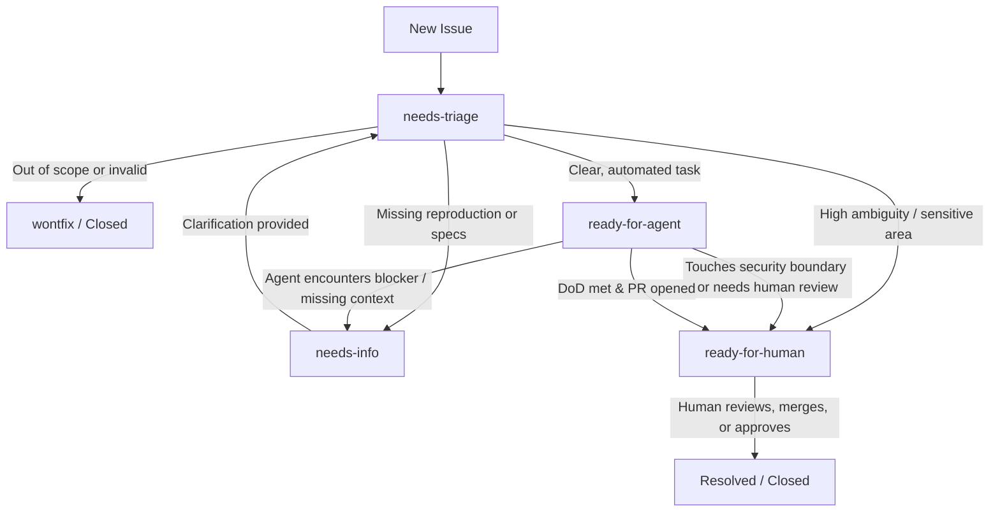

# Triage Labels & Lifecycle

This repository uses the canonical five-role triage vocabulary to manage ticket states and transitions between humans and autonomous agents.

---

## 1. Canonical Label Vocabulary

| Label | Meaning | Primary Owner |
|---|---|---|
| `needs-triage` | Newly filed or reopened; needs maintainer evaluation | Maintainer / Triage Agent |
| `needs-info` | Incomplete issue; waiting for reporter clarification | Reporter |
| `ready-for-agent` | Well-scoped, unambiguous requirements; ready for autonomous agent work | AI Agent |
| `ready-for-human` | Requires human judgment, subjective architecture, or sensitive security review | Human Engineer |
| `wontfix` | Out of scope, duplicate, or rejected; terminal state | None (Closed) |

---

## 2. State Transition Flow

---

## 3. Lifecycle Transitions & Trigger Conditions

### `needs-triage`
- **When Applied**: Automatically applied to all incoming issues or when an issue is reopened.
- **Next States**:
  - `needs-info`: If details, repro steps, or acceptance criteria are missing.
  - `ready-for-agent`: If scope, acceptance criteria, and boundaries are clear for autonomous implementation.
  - `ready-for-human`: If the task involves architectural pivots, business decisions, or mandatory human review areas (see [security.md](security.md)).
  - `wontfix`: If rejected, duplicate, or out of scope.

### `needs-info`
- **When Applied**: When clarification, logs, or reproductive examples are required from the issue creator.
- **Next States**:
  - `needs-triage`: When the reporter posts the requested details.
  - `wontfix`: If no response is provided after a reasonable timeout period.

### `ready-for-agent`
- **When Applied**: When the issue is fully specified and safe for an AI agent to claim and execute.
- **Next States**:
  - `needs-info`: If an agent encounters unspecified edge cases or missing requirements during implementation.
  - `ready-for-human`: When the agent finishes implementation and requests human code review, or if changes touch sensitive security boundaries.

### `ready-for-human`
- **When Applied**: When a ticket requires human engineering, creative direction, or human sign-off on PRs submitted by agents.
- **Next States**:
  - `ready-for-agent`: If a human breaks down the problem into discrete, well-scoped sub-tickets for agents.
  - `Resolved / Closed`: When human completes or merges the work.

### `wontfix`
- **When Applied**: Issue is declined, invalid, or duplicate.
- **Next States**: Terminal state; the issue is closed with an explanatory comment.
